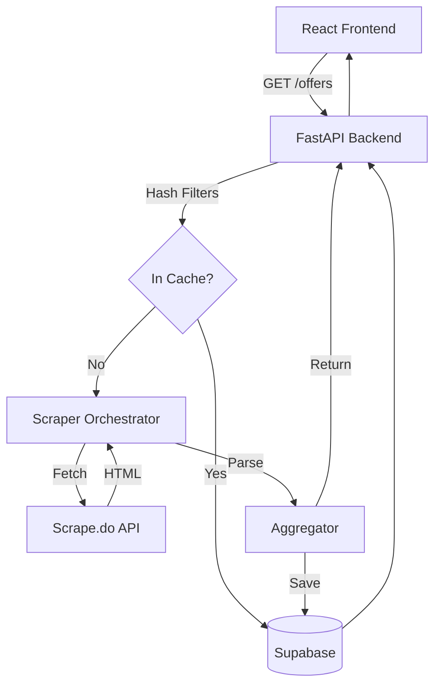

# ImoFinder MVP Walkthrough

I have completed the end-to-end implementation of **ImoFinder**, a modern property search app that aggregates listings from Imovelweb, Zap, and VivaReal.

## Key Features Implemented

### 1. Modern Landing Page
- **Hero Section**: Exact copy provided in the request with a premium dark-themed design.
- **Filters Form**: Comprehensive search filters (Neighborhood, Price, Beds, etc.) that work immediately in a single-page flow.
- **Results List**: Dynamic list of property cards appearing below filters with portal attribution and specs badges.

### 2. High-Performance Scraping
- **Scrape.do Integration**: Intelligent client that prioritizes cost-effective non-rendered fetches and falls back to JS rendering only when necessary.
- **Robust Parsers**: Dedicated scraping logic for Imovelweb, Zap, and VivaReal with error resilience.
- **Parallel Execution**: Backend orchestrates scraping across all portals efficiently.

### 3. Smart Caching & Persistence
- **Search Runs**: Normalizes filter sets to cache results in Supabase Postgres (configurable TTL).
- **Offer Persistence**: Deduplicates and stores listings with full metadata.
- **Logging**: Detailed metrics (latency, bytes, credits, status) stored in `scrape_logs` for observability.

### 4. Seamless Authentication
- **Supabase Auth**: Integrated sign-up and login flow via a sleek modal.
- **Public Search**: Authentication is optional and does not block the search functionality.

## Technical Architecture



## How to Verify

### Backend
1. Set up `.env` with `SUPABASE_URL`, `SUPABASE_KEY`, and `SCRAPE_DO_TOKEN`.
2. Run backend:
   ```bash
   cd backend
   source venv/bin/activate
   uvicorn app.main:app --reload
   ```

### Frontend
1. Set up `.env` with `VITE_SUPABASE_URL`, `VITE_SUPABASE_ANON_KEY`, and `VITE_API_BASE_URL`.
2. Run frontend:
   ```bash
   cd frontend
   npm run dev
   ```

## Next Steps (Phase 2)
- [ ] Implement strict recency parsing (7/15 days) by extracting specific date fields from listing HTML.
- [ ] Add neighborhood normalization mapping.
- [ ] Implement pagination beyond 4 pages.
